# Checkout & pull flow

The "move HEAD somewhere" gesture has three entry points in the UI, but they all
flow through one store action: `checkout()`. One additional store action
(`pullLocalBranch()`) extends it with a fast-forward pull. This doc is the
source of truth for how those flows behave.

## Entry points

| Where                                          | What it does                                                                     |
| ---------------------------------------------- | -------------------------------------------------------------------------------- |
| **Toolbar → BranchSwitcher**                   | Pick a branch (local or remote-tracking) from a dropdown.                        |
| **Graph → ref badge dblclick**                 | Local branch / lone remote → checkout. Group with both local + remote → ff-pull. |
| **`pullLocalBranch(branch)` from a ref badge** | Checkout + `git pull --ff-only` (the new "refresh this branch" gesture).         |

## The unified `checkout()` flow

`src/state/store.ts → checkout(branch, kind)`. Same path for every entry point;
the kind (`"branch"` vs `"remoteBranch"`) only changes which backend command
runs.

```mermaid
flowchart TD
    A[User triggers checkout<br/>BranchSwitcher, badge dblclick,<br/>or pullLocalBranch] --> B[checkout&#40;branch, kind&#41;]
    B --> C{statusEntries<br/>non-empty?}
    C -- no --> E
    C -- yes --> D[stashSave&#40;repoPath,<br/>'auto: pre-checkout &lt;branch&gt;'&#41;]
    D --> E{kind?}
    E -- remoteBranch --> F[checkoutTrack&#40;repoPath, branch&#41;<br/><i>git checkout --track origin/feature</i>]
    E -- branch --> G[checkoutBranch&#40;repoPath, branch&#41;<br/><i>git checkout feature</i>]
    F --> H{stashedRef?}
    G --> H
    H -- empty --> J
    H -- set --> I[stashPop&#40;repoPath, stashedRef&#41;]
    I -- pop ok --> J[refresh&#40;&#41;]
    I -- pop conflict --> K[toastError 'Stash pop conflict on &lt;branch&gt;'<br/>Stash preserved at stashedRef]
    K --> J
    F -- backend error --> L[set error, throw]
    G -- backend error --> L
    I -- backend error --> L
    D -- backend error --> L
    J --> M[done]
    L --> M
```



### Key behaviors

- **Smart switch.** Dirty working tree never blocks the checkout — we stash,
  switch, then pop. The user never sees a "would overwrite" error.
- **Pop conflict is not a checkout failure.** If `git stash pop` conflicts, the
  stash is preserved and surfaced via toast; the checkout itself still
  succeeded.
- **Stash is never silently dropped.** Either it pops cleanly, or the user is
  told where it is.
- **Single source of failure surface.** Any backend error sets
  `state.error` and rethrows; UI shows a toast and disables the relevant
  buttons.

## The `pullLocalBranch()` flow

Triggered by dblclicking a **group** ref badge that contains BOTH a local
branch and a matching remote-tracking ref (e.g. `main` + `origin/main`). It's
the "refresh this branch" gesture — checkout onto it, then fast-forward pull.

```mermaid
flowchart TD
    A[Dblclick ref-badge group<br/>local + remote share a name] --> B[onCheckout&#40;&#41;<br/>in CommitList.tsx]
    B --> C{action.kind?}
    C -- pull --> D[pullLocalBranch&#40;branch&#41;]
    C -- checkout --> E[checkout&#40;name, refKind&#41;]
    D --> F[set pulling: true]
    F --> G[checkout&#40;branch, 'branch'&#41;]
    G -- error --> H[toastError 'Pull failed'<br/>set pulling: false]
    G --> I[pullBranch&#40;repoPath, 'ffOnly'&#41;]
    I -- ok --> J[refresh&#40;&#41;]
    J --> K[toastSuccess 'Pull complete']
    K --> L[set pulling: false]
    I -- error --> M[toastError 'Pull failed'<br/>'Branch has diverged — use the<br/>toolbar pull menu to rebase/merge']
    M --> L
    H --> N[done]
    L --> N
    E --> N
```



### Why `checkout` first, not `git pull <remote> <branch>`?

`git pull <remote> <branch>` only updates the working copy of the _current_
branch — it doesn't move HEAD. So if you're on `feat-x` and dblclick
`origin/main`, a bare `git pull origin main` would merge into `feat-x` and
silently corrupt the working tree. Moving onto the target branch first keeps
the user's mental model intact: "I want branch X to be current, and up to
date."

### Why `--ff-only` and not just `Ff`?

The "refresh this branch" gesture is meant to be a safe, non-interactive
fast-forward. The toolbar's `Pull` menu offers three modes (ff, ffOnly,
rebase); from a dblclick we want exactly one — the safe one. If the branches
have diverged, we surface a clear error pointing the user at the toolbar
where they can pick rebase/merge.

## Where each piece lives

```
src/state/store.ts
  checkout(branch, kind)        ← unified smart-switch flow
  pullLocalBranch(branch)       ← checkout + ff pull (new)

src/features/commit-graph/CommitList.tsx
  onCheckout(action)            ← routes CheckoutAction → checkout / pullLocalBranch

src/features/commit-graph/refBadge.tsx
  CheckoutAction type           ← { kind: "checkout", name, refKind }
  RefBadge dblclick             ← | "pull", branch |
    single local branch         → checkout(name, "branch")
    single remote branch        → checkout(fullName, "remoteBranch")
  RefBadgeGroup dblclick
    local + remote in group     → pull(localBranch.name)
    local only                  → checkout(localBranch.name, "branch")
    remote only                 → checkout(fullName, "remoteBranch")

src/features/toolbar/BranchSwitcher.tsx
  onSelect(name, kind)          → checkout(name, kind)
```

## Future work (not yet implemented)

- **Detached HEAD** — `git checkout <hash>` for arbitrary commits isn't
  routed yet; the badge's `head` kind currently only marks the _current_
  branch, not an arbitrary checked-out commit.
- **Create branch** — `git checkout -b <name>` from a remote or commit isn't
  surfaced; users must fall back to the CLI.
- **Pull mode picker from dblclick** — if ff-only fails, we currently just
  error. A follow-up could surface a small "rebase/merge" picker right on the
  toast.
